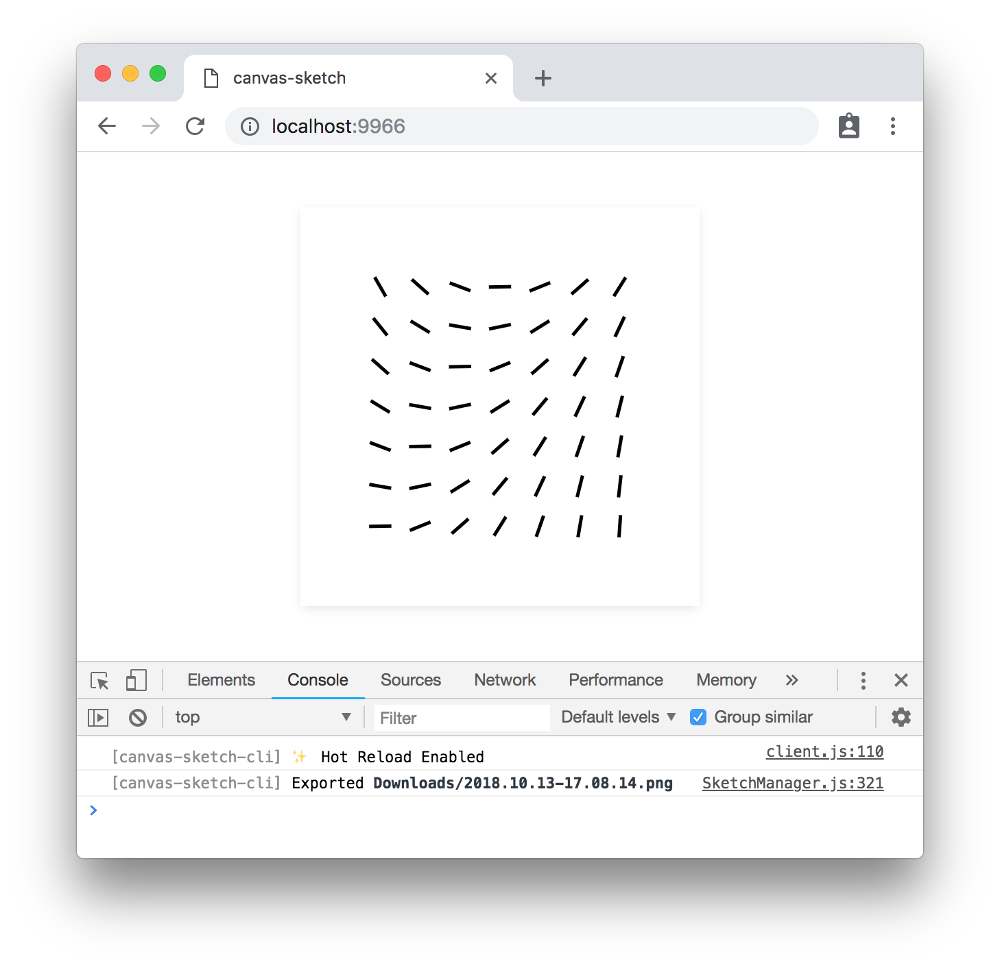
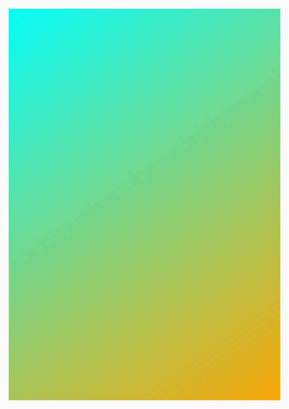

### canvas-sketch

`canvas-sketch` is a loose collection of tools, modules and resources for creating generative art in JavaScript and the browser.

- :closed_book: [Documentation](./docs/README.md)

- :wrench: [Examples](./examples/)

#

<p align="center">
  <sub>example of <code>canvas-sketch</code> running in Chrome</sub>
</p>

<p align="center">
  <sub>↓</sub> 
</p>

<p align="center">
  
</p>

### Quick Start with Node.js & npm

To jump directly into `canvas-sketch`, try the following terminal commands with `node@15.x` and `npm@7.x` or newer:

```sh
# Make a new folder to hold all your generative sketches
mkdir my-sketches

# Move into that folder
cd my-sketches

# Scaffold a new 'sketch.js' file and open the browser
npx canvas-sketch-cli sketch.js --new --open
```

> :bulb: Notice the `x` in `npx`, and the `-cli` in `canvas-sketch-cli`

Now, while in the browser, hit `Cmd + S` or `Ctrl + S` to export a high-resolution PNG of your artwork to your `~/Downloads` folder.

### More Commands

Some other commands to try:

```sh
# Start the tool on an existing file and change PNG export folder
npx canvas-sketch-cli src/foobar.js --output=./tmp/

# Start a new sketch from the Three.js template
npx canvas-sketch-cli --new --template=three --open

# Build your sketch to a sharable HTML + JS website
npx canvas-sketch-cli src/foobar.js --build

# Develop with "Hot Reloading" instead of full page reload
npx canvas-sketch-cli src/foobar.js --hot
```

For more features and details, see the [Documentation](./docs/README.md).

### Installation Guide

The examples above use `npx` which is a convenient way to install and run a local CLI tool, but you might want to setup `canvas-sketch` as a global command. You can see more details in the [Installation Guide](./docs/installation.md).

### Code Example

Once you have the CLI tool running, you can try this example of an A4 print artwork.

```js
const canvasSketch = require('canvas-sketch');

// Sketch parameters
const settings = {
  dimensions: 'a4',
  pixelsPerInch: 300,
  units: 'in'
};

// Artwork function
const sketch = () => {
  return ({ context, width, height }) => {
    // Margin in inches
    const margin = 1 / 4;

    // Off-white background
    context.fillStyle = 'hsl(0, 0%, 98%)';
    context.fillRect(0, 0, width, height);

    // Gradient foreground
    const fill = context.createLinearGradient(0, 0, width, height);
    fill.addColorStop(0, 'cyan');
    fill.addColorStop(1, 'orange');

    // Fill rectangle
    context.fillStyle = fill;
    context.fillRect(margin, margin, width - margin * 2, height - margin * 2);
  };
};

// Start the sketch
canvasSketch(sketch, settings);
```

When exporting the image in browser with `Cmd + S` or `Ctrl + S` keystrokes, the saved PNG file matches 21 x 29.7 cm at 300 DPI, and can be printed with archival ink on quality paper.

Resulting image looks something like this:



###### <sup>Note: The above PNG file has been scaled/optimized for web.</sup>

### Roadmap

There are many features still outstanding, such as:

- API & CLI Docs
- Easy & beginner-friendly examples
- Website/frontend
- HUD/GUI controls
- "Gallery Mode" for viewing many local sketches
- External Module for utilities (randomness, geometry, etc)
- Unit tests
- More??

### License

MIT, see [LICENSE.md](http://github.com/mattdesl/canvas-sketch/blob/master/LICENSE.md) for details.
