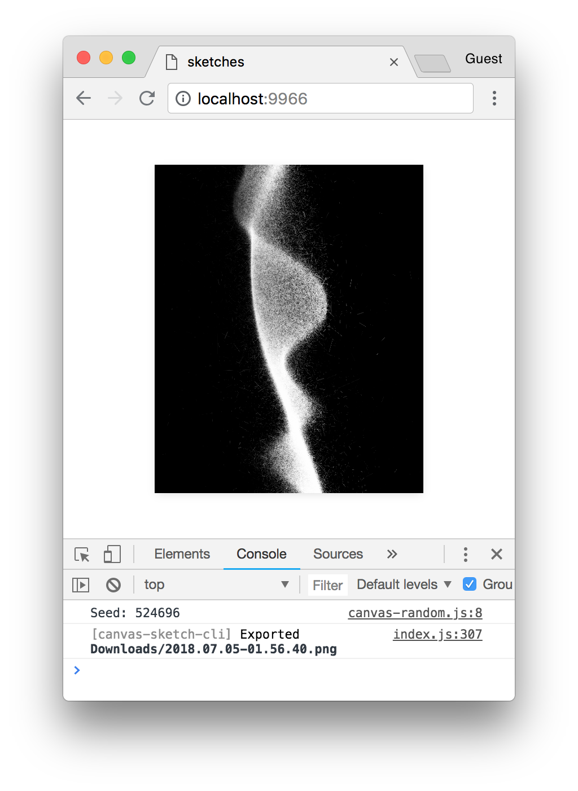

#

### :warning:
### WORK IN PROGRESS

---

### canvas-sketch

`canvas-sketch` is a loose collection of tools, modules and resources for creating generative art in JavaScript and the browser.

- :sparkles: [Website](https://competent-beaver-2ad4cc.netlify.com/)

- :closed_book: [Documentation](./docs/README.md)

- :wrench: [Examples](./examples/)

#

<p align="center">
  <sub>example of <code>canvas-sketch</code> running in Chrome</sub>
</p>

<p align="center">
  <sub>↓</sub> 
</p>

<p align="center">
  
</p>

### Quick Start with Node.js & npm

To jump directly into `canvas-sketch`, try the following terminal commands.

```sh
# Install the CLI tool globally
npm install canvas-sketch-cli -g

# Make a new folder to hold all your generative sketches
mkdir my-sketches

# Move into that folder
cd my-sketches

# Start a new basic sketch and open the browser
canvas-sketch --new --open
```

While in the browser, hit `Cmd + S` or `Ctrl + S` to export a high-resolution PNG of your artwork to your `~/Downloads` folder.

Some other commands to try:

```sh
# Start the tool on an existing file and change PNG export folder
canvas-sketch src/foobar.js --output=./tmp/

# Start a new sketch from the Three.js template
canvas-sketch --new --template=three --open

# Build your sketch to a sharable HTML + JS website
canvas-sketch src/foobar.js --build
```

For more features and details, see the [Documentation](./docs/README.md).

### License

MIT, see [LICENSE.md](http://github.com/mattdesl/canvas-sketch/blob/master/LICENSE.md) for details.
