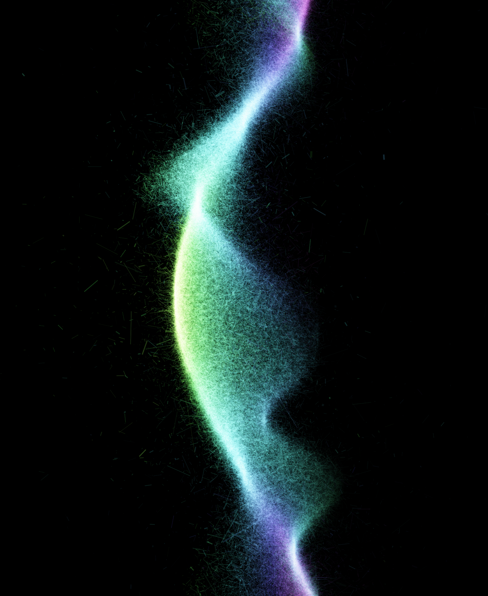

#### :closed_book: [canvas-sketch](../README.md) → Documentation

---

### About

`canvas-sketch` is a loose collection of tools, modules and resources for creating generative art in JavaScript and the browser using the `<canvas>` tag. It is designed to help create artworks and images with code, randomness, algorithms, and emergent systems.

You can use `canvas-sketch` to export high-resolution PNG for Giclée prints, render image sequences for GIF and MP4 loops, generate SVG files for mechanical pen plotters (like AxiDraw), automatically git hash your artworks for long-term archiving, and much more.

These tools can be used on their own, or combined with your favourite graphics library like ThreeJS, P5.js, Pixi, Regl, D3, etc.

### API Docs

  - [`canvas-sketch` — API Docs](./api.md)

  - [`canvas-sketch-cli` — CLI Docs](./cli.md)

### Guides

- [Installing and Using `canvas-sketch`](./installation.md)

- [A "Hello, World" Sketch](./hello-world.md)

- [Animated Sketches](./animated-sketches.md)

- [Hot Reloading](./hot-reloading.md)

- [Developing with Physical Units (inches, centimeters)](./physical-units.md)

  - [Paper Size Presets](./physical-units.md#paper-size-presets)

  - [Bleeds & Safe Zones](./physical-units.md#bleeds--safe-zones)

  - [Running `canvas-sketch` in Node.js for Very Large Prints](./physical-units.md#running-canvas-sketch-in-node-js-for-very-large-prints)

- [Exporting Artwork to PNG, GIF, SVG, MP4 and other files](./exporting-artwork.md)

  - [Exporting Animations](./exporting-artwork.md#exporting-animations)

  - [Exporting Other File Types](./exporting-artwork.md#exporting-other-file-types)

  - [Automatic Git Hashing for Long-Term Archiving](./exporting-artwork.md#automatic-git-hashing-for-long-term-archiving)

- [Other Topics](./other-topics.md)

  - [Using WebGL](./other-topics.md#using-webgl)

  - [Using glslify for modular GLSL](./other-topics.md#using-glslify-for-modular-glsl)

  - [Using ThreeJS, P5.js, and other libraries](./other-topics.md#using-threejs-p5js-and-other-libraries)

  - [Utilities for Randomness, Math, Geometry, Color, etc.](./other-topics.md#utilities-for-randomness-math-geometry-color-etc)

  - [Developing Pen Plotter Artwork](./other-topics.md#developing-pen-plotter-artwork)

  - [Async Sketches: Loading Images & Other Assets](./other-topics.md#loading-images--other-assets)

  - [Building for Web, Installations & VJ](./other-topics.md#building-for-web-installations--vj)

- [Troubleshooting](./troubleshooting.md)

### Contributing

If you are interested in helping develop or maintain `canvas-sketch` ecosystem:

- [Contribution Guideline](./contributing.md)

<!-- 
# foo

- [Installing and Using `canvas-sketch`](#)
- [A "Hello, World" Sketch](#)
- [Adding Animation](#)
- [Exporting Print Resolution PNG Images](#)
- [Exporting Image Sequences for GIF & MP4](#)
- [Exporting SVG and Pen Plotter Artwork](#)
- [Using Physical Units (inches, centimeters)](#)
- [Utilities: Randomness, Math, Color and More](#)
- [Using WebGL, ThreeJS, Pixi and other libraries](#)
- [Loading Images, Audio and Other Assets](#)
- [Using Git File Name Hashing for Long-Term Archiving](#)
- [Advanced Media Exporting (3D Models, Layers, etc)](#)

 -->
