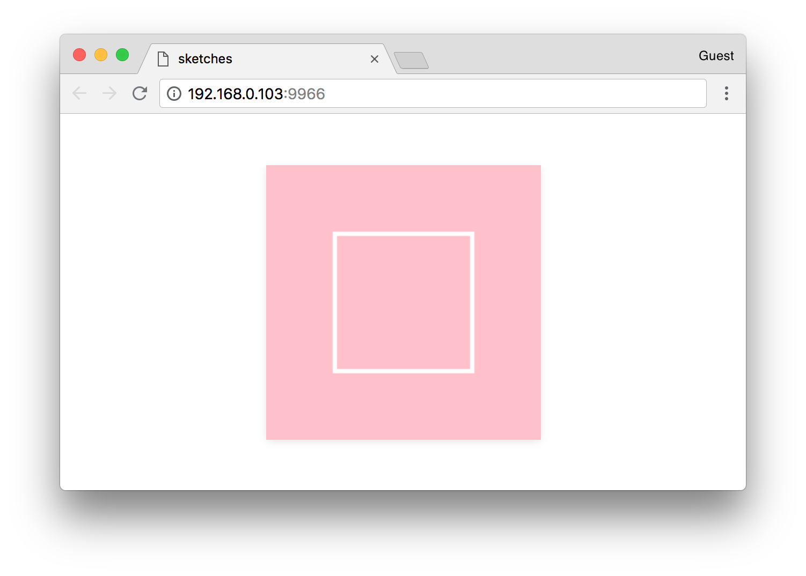

#### <sup>:closed_book: [canvas-sketch](../README.md) → [Documentation](./README.md) → Hello, World</sup>

---

### A "Hello, World" Sketch

After [installing the command-line interface](./installation.md), you can start to create a new artwork.

With `canvas-sketch`, you define an artwork by a *sketch* function. This sets up local state and loads any assets.

This *sketch* function then returns a *renderer* function. The renderer is in charge of drawing the artwork based on `props`, i.e. the current state of the application. 

To start, let's generate a new sketch file at `./hello.js`.

```sh
canvas-sketch hello.js --new
```

Now, with the development server running on `localhost:9966`, we can edit the new file and replace it with the following:

```js
// Import the library
const canvasSketch = require('canvas-sketch');

// Specify some output parameters
const settings = {
  // The [ width, height ] of the artwork in pixels
  dimensions: [ 256, 256 ]
};

// Start the sketch
const sketch = () => {
  return (props) => {
    // Destructure what we need from props
    const { context, width, height } = props;

    // Fill the canvas with pink
    context.fillStyle = 'pink';
    context.fillRect(0, 0, width, height);

    // Now draw a white rectangle in the center
    context.strokeStyle = 'white';
    context.lineWidth = 4;
    context.strokeRect(width / 4, height / 4, width / 2, height / 2);
  };
};

// Start the sketch with parameters
canvasSketch(sketch, settings);
```

You should see this in the browser:



### Canvas API

`canvas-sketch` is built around the browser's `<canvas>` element. There are two different APIs you can take advantage of with Canvas:

- [Canvas 2D](https://developer.mozilla.org/en-US/docs/Web/API/CanvasRenderingContext2D) — for rendering 2D shapes, lines, polygons, gradients, and text
- [WebGL](https://developer.mozilla.org/en-US/docs/Web/API/WebGL_API/Tutorial/Getting_started_with_WebGL) — for rendering 3D and hardware-accelerated graphics

By default, `canvas-sketch` will set up a new 2D canvas, giving you a `{ context }` property. For more details on what is possible with the Canvas 2D context, see the [MDN Canvas documentation](https://developer.mozilla.org/en-US/docs/Web/API/CanvasRenderingContext2D).

### The `settings` Parameter

Notice we passed a `settings` object to `canvasSketch()` which defines how the canvas should be scaled, rendered and exported.

The `dimensions` specifies the `[ width, height ]` of our artwork (by default, in pixels). If you don't specify dimensions, the artwork will scale to the full size of the browser.

### `require()` and Node/npm

The docs and examples use CommonJS `require()` to bring in the `canvas-sketch` library, as well as other libraries and utilities. If you prefer, you can also write your sketches with `import` and `export` statements, as the CLI tool also supports ES Module syntax:

```js
import canvasSketch from 'canvas-sketch';
```

### Exporting Artworks as PNG

If you hit `Cmd + S` or `Ctrl + S` while developing (with the window in focus), the browser will download a PNG image of your canvas. Usually this file is saved to your `~/Downloads` folder.

We will come back to this feature later, as there are many options to export high quality prints, animation sequences, etc. You can also read more about it in the [Exporting](./exporting-artwork.md) guide.

### Props & State

The structure of `canvas-sketch` is inspired by React rendering, and it's recommended to make the renderer as *pure* as possible (i.e. same props always leads to same result).

Since your sketch may re-render at times (i.e. during export or when the canvas size changes), you shouldn't introduce side-effects and randomness into your render function.

Here is what *not* to do:

```js
// Not so good !
const sketch = () => {
  return ({ width }) => {
    // !!!
    // This may produce different results in re-renders
    const startX = Math.random() * width;
    context.fillRect(startX, 0, 50, 50);
  };
};
```

Instead, you can define local state (like random values that should be consistent across renders) outside your renderer.

```js
// Good !
const sketch = () => {
  // Select an initial 0..1 random, outside your renderer
  const startXScale = Math.random();

  return ({ width }) => {
    // Now scale to current width to get consistent rendering
    const startX = startXScale * width;
    context.fillRect(startX, 0, 50, 50);
  };
};
```

## 

<sub>Now that you've got a basic sketch, you can move on to [Animated Sketches](./animated-sketches.md).</sub>

#### <sup>[← Back to Documentation](./README.md)