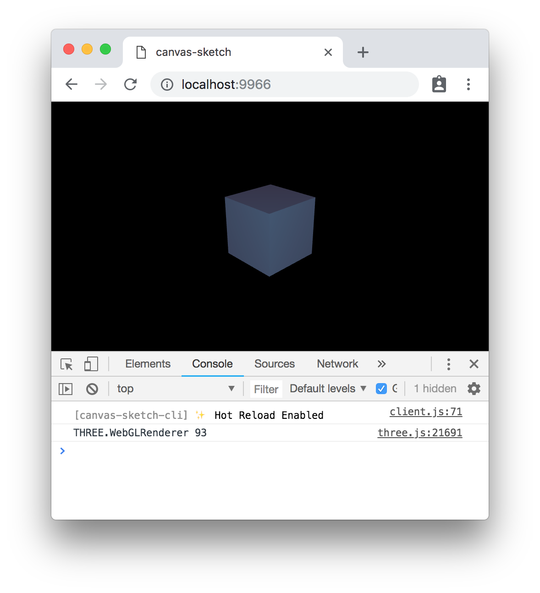

#### <sup>:closed_book: [canvas-sketch](../README.md) → [Documentation](./README.md) → Hot Reloading</sup>

---

### Hot Reloading

> :wrench: You must update to `canvas-sketch@0.0.25` and `canvas-sketch-cli@1.0.21` or newer to use this feature. See [Updating](./installation.md#updating-canvas-sketch) for details.

The command-line tool supports *Hot Reloading* your sketches. When enabled, code changes will be evaluated and applied without forcing an entire page reload.

Use the `--hot` flag to enable it:

```sh
canvas-sketch my-sketch.js --hot
```

This provides a much better feedback loop while developing creative content, as you no longer have jarring flashes as the page reloads, and the `{ time }` and `{ frame }` parameters of animated sketches will be persisted between code updates.

<p align="center">
  
</p>

## How it works

This is implemented by destroying the previously running instance of your sketch, unmounting it from the DOM, and then re-creating and re-mounting it with your newly evaluated code. This means that you can change settings and other properties outside the scope of your render function, and the changes will still be applied.

## Managing Side-Effects

Since your sketch will be un-loaded and re-created each time you update the code, it's important to "clean up" any side effects that your sketch creates.

For example, here is an example of unloading an interval timer and mouse events:

```js
const sketch = () => {
  const timer = setInterval(() => {
    console.log('Tick!');
  });

  const onClick = () => {
    console.log('Screen clicked!');
  };
  window.addEventListener('click', onClick);

  return {
    render ({ context, width, height, frame }) {
      // Render your content...
    },

    unload () {
      // Dispose of side-effects
      clearInterval(timer);
      window.removeEventListener('click', onClick);
    }
  };
};

canvasSketch(sketch, { animate: true });
```

For example, if you are using ThreeJS you can use `renderer.dispose()` to clean up its WebGL context during unload.

With regular page reloading (without the `--hot` flag), the browser will clean up resources automatically during page unload (including timers, events and canvas contexts). However, manually unloading resources is still a good practice if you want your sketch to be entirely self-contained and reusable.

## Multiple Sketches

If you happen to have multiple sketches (multiple `canvasSketch()` calls) in a single application, you will need to provide a unique `{ id }` for each sketch to ensure that hot reloading is applied correctly.

```js
canvasSketch(mainSketch, { id: 'primary' });
canvasSketch(otherSketch, { id: 'secondary' });
```

## 

<sub>Now that you know about hot replacement, you may want to read about [Developing with Physical Units](./physical-units.md).</sub>

#### <sup>[← Back to Documentation](./README.md)