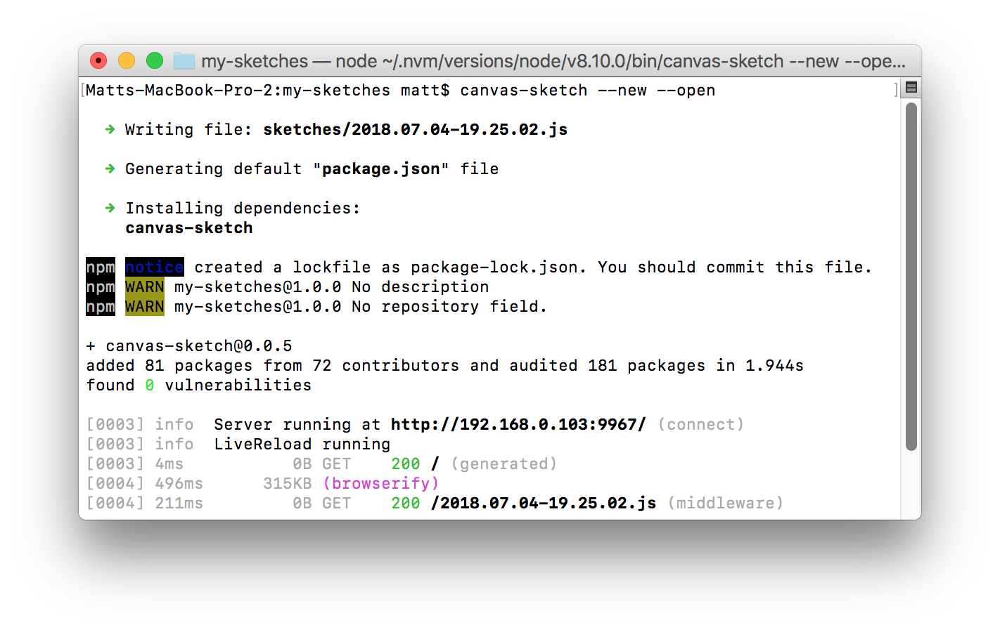

#### <sup>:closed_book: [canvas-sketch](../README.md) → [Documentation](./README.md) → Installation</sup>

---

### Installation

The recommended way to use `canvas-sketch` and its tooling is with its *command-line interface*. This will run a local development server that handles browser reload on file save, high-quality PNG exporting, and other features.

Requirements:

- [Node.js](https://nodejs.org/en/) 8.10.0 or higher
- [npm](https://www.npmjs.com/) 6.1.0 or higher
- A command-line terminal (such as the default `Terminal.app` in OSX, or [cmder](http://cmder.net/) in Windows)

If you haven't got these requirements, or if you'd rather use the tool without a package manager, see the following sections:

- [How to Install Node.js and npm](#installing-node-npm)
- [Using `canvas-sketch` with Webpack and Other Bundlers](#using-with-other-bundlers)
- [Using `canvas-sketch` without Node.js and npm]
(#using-without-nodejs-and-npm)

### Quick Start

The fastest way to get started is to install the tool globally:

```sh
# Install the CLI tool globally
npm install canvas-sketch-cli -g

# Make a new folder to hold all your sketches
mkdir my-sketches

# Move into that folder
cd my-sketches

# Start a new sketch and open the browser
canvas-sketch --new --open
```

<center></center>

The above `canvas-sketch` command does a few things:

- Write a new dummy JavaScript file into a `sketches/` folder in your current working directory with a time-stamped name, like `2018.07.04-19.25.02.js`
- Generate a default `package.json` file for your dependencies
- Install any dependencies needed to run the sketch (in this case, the `canvas-sketch` library)

It should also launch your default browser to [http://localhost:9966/](http://localhost:9966/) (the local development server), and present you with a square white canvas.

<center></center>

Now, you can edit the newly created file in the `sketches/` folder with your favourite code editor, like [VSCode](https://code.visualstudio.com/) or [Sublime Text](https://www.sublimetext.com/). For example, change the `'white'` fill style to `'red'` and save your file, and the browser should reload immediately.

```js
const canvasSketch = require('canvas-sketch');

const settings = {
  dimensions: [ 2048, 2048 ]
};

const sketch = () => {
  return ({ context, width, height }) => {
    context.fillStyle = 'red'; // <-- try changing the color
    context.fillRect(0, 0, width, height);
  };
};

canvasSketch(sketch, settings);
```

Now that you've got it running, you could try out a few different commands:

```sh
# Run the development server on an existing file
canvas-sketch sketches/my-sketch.js

# Generate a new sketch from the regl template
canvas-sketch --new --template=regl --open

# Bundle your sketch to a HTML + JS file in dist/ folder
canvas-sketch sketches/my-sketch.js --build --dir dist/

# Paste the clipboard contents to a new file at './foo.js'
pbpaste | canvas-sketch foo.js --new
```