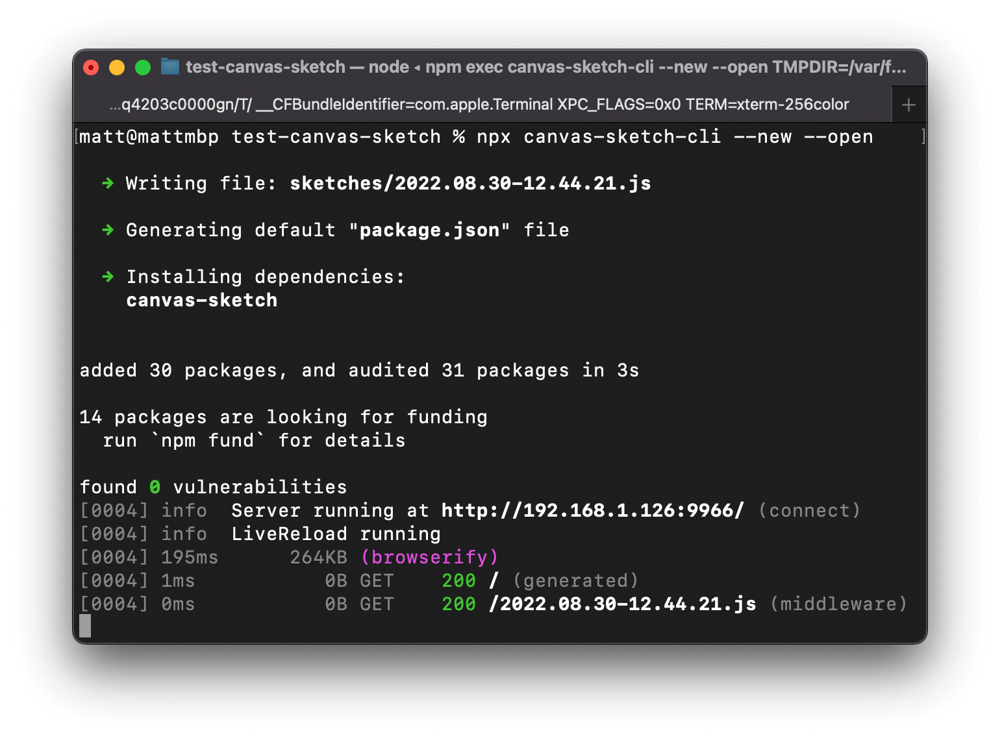
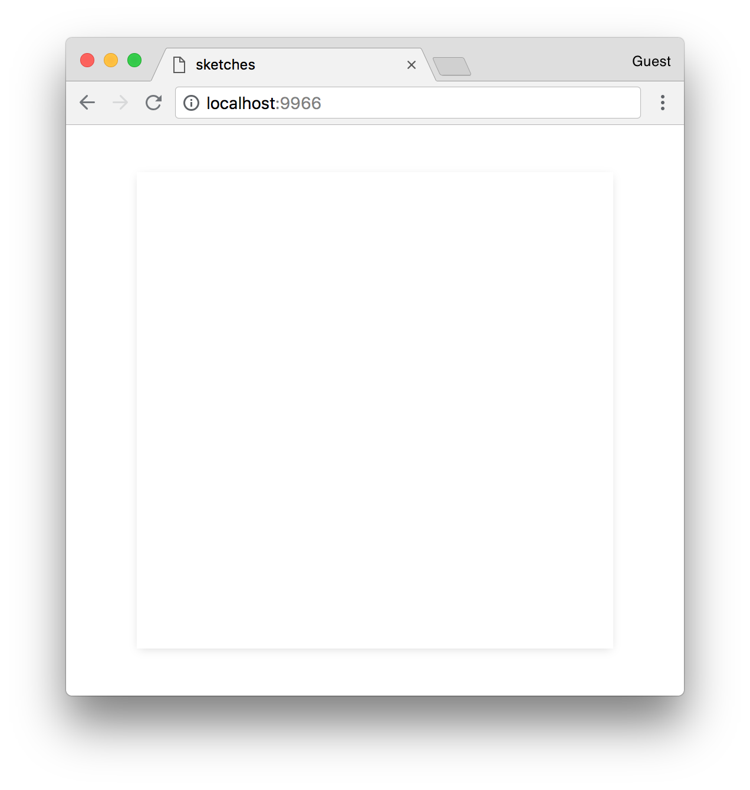

#### <sup>:closed_book: [canvas-sketch](../README.md) → [Documentation](./README.md) → Installation</sup>

---

### Installation

The recommended way to use `canvas-sketch` and its tooling is with its _command-line interface_. This will run a local development server that handles browser reload on file save, high-quality PNG exporting, and other features.

Requirements:

- [Node.js](https://nodejs.org/en/) 15 or higher
- [npm](https://www.npmjs.com/) 7 or higher
- A command-line terminal (such as the default `Terminal.app` in macOS, or [cmder](http://cmder.net/) in Windows)

If you don't have these tools, or would rather not use them, see the following:

- [Installing Node.js, npm and a terminal](./troubleshooting.md#installing-nodejs-npm-and-a-terminal)
- [Using `canvas-sketch` with Webpack and Other Bundlers](./troubleshooting.md#using-canvas-sketch-with-webpack-and-other-bundlers)
- [Using `canvas-sketch` without Node.js and npm](./troubleshooting.md#using-canvas-sketch-without-nodejs-and-npm)

### Quick-Start with `npx`

A simple way to use the tool is with [`npx`](https://docs.npmjs.com/cli/v7/commands/npx) which comes built-in to npm. Run it like this:

```sh
# Make a new folder to hold all your generative sketches
mkdir my-sketches

# Move into that folder
cd my-sketches

# Scaffold a new sketch file and open the browser
npx canvas-sketch-cli --new --open
```

> :bulb: Using `npx`, instead of the `canvas-sketch` command, you will use `npx canvas-sketch-cli` (notice the `-cli` suffix).



The above command does a few things:

- Stub out a new sketch into `sketches/[current-timestamp].js`
- Generate a default `package.json` for your dependencies
- Install any required dependencies (in this case, `canvas-sketch`)

It also launches your default browser to [http://localhost:9966/](http://localhost:9966/) (the development server), showing a blank white canvas:



Now you can edit the newly created JavaScript file in the `sketches/` folder. When you save changes, the browser will reload immediately.

For example, try changing the `'white'` fill style to `'red'`.

```js
const canvasSketch = require("canvas-sketch");

const settings = {
  dimensions: [2048, 2048],
};

const sketch = () => {
  return ({ context, width, height }) => {
    context.fillStyle = "red"; // <-- Try changing the color
    context.fillRect(0, 0, width, height);
  };
};

canvasSketch(sketch, settings);
```

### Global Installation

You might want to install the CLI tool globally, so that you can just type `canvas-sketch` into your terminal. This is the command that a lot of the documentation will assume.

You can install the latest version like so:

```sh
npm install canvas-sketch-cli -g
```

> :bulb: If you run into errors, see [Troubleshooting](./troubleshooting.md#fixing-eaccess-error-on-npm-install--g).

Example usage:

```sh
# Make a new folder to hold all your sketches
mkdir my-sketches

# Move into that folder
cd my-sketches

# Start a new sketch and open the browser
canvas-sketch sketch.js --new --open
```

#### 💾 Exporting as PNG

In the browser, hit `Cmd + S` or `Ctrl + S` to export your canvas as a PNG file. It will be saved to your `~/Downloads` folder (and similar across other platforms).

#### :bulb: A Few More Examples to Try

Now that you've got it running, you could try out a few different commands:

```sh
# Run the development server on an existing file
canvas-sketch src/foobar.js

# Start a new sketch from the Three.js template
canvas-sketch --new --template=three --open

# Build your sketch to a sharable HTML + JS website
canvas-sketch sketches/my-sketch.js --build

# Paste the clipboard contents & run a new sketch at './foo.js'
pbpaste | canvas-sketch foo.js --new
```

### Updating `canvas-sketch`

To update the CLI tool, you can re-install it globally:

```sh
npm install canvas-sketch-cli@latest -g
```

When you run `canvas-sketch` in a folder, it will often install the library locally as a `dependency` in your `package.json` for that folder. To update this, you can re-install the library (not the CLI) locally in each project folder that uses it:

```sh
npm install canvas-sketch@latest
```

### Installing the CLI Locally

If you prefer not to install your CLI tools globally, you can install the CLI locally in each project that you need it by saving it as a `devDependency`:

```sh
npm install canvas-sketch-cli --save-dev
```

Now, to run it in each project, you can add `canvas-sketch` commands to your [`npm run` scripts](https://docs.npmjs.com/cli/run-script), or use [`npx`](https://blog.npmjs.org/post/162869356040/introducing-npx-an-npm-package-runner) which will try to run the locally-installed version first:

```sh
npx canvas-sketch my-sketch.js --open
```

> :bulb: If you've installed `canvas-sketch-cli` locally, you can then use `npx` to run the command in that project folder without needing to include the `-cli` suffix.

##

<sub>Now that you're set up, you might like to read [A "Hello, World" Sketch](./hello-world.md).</sub>

#### <sup>[← Back to Documentation](./README.md)
