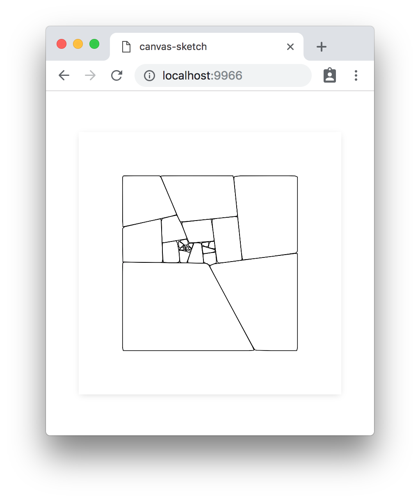
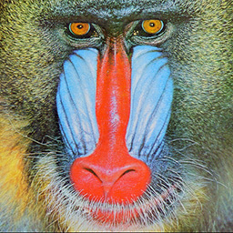

#### <sup>:closed_book: [canvas-sketch](../README.md) → [Documentation](./README.md) → Other Topics</sup>

---

### Utilities for Randomness, Math, Geometry, Color, etc.

See [canvas-sketch-util](https://github.com/mattdesl/canvas-sketch-util).

Examples:

```js
// Math utilities
const { lerp, clamp } = require('canvas-sketch-util/math');

// Randomness & noise utilities
const { noise2D } = require('canvas-sketch-util/random');
```

These utilities have been extracted into a separate module as they are not directly dependent on `canvas-sketch`, and can be useful outside the scope of this framework.

### Developing Pen Plotter Artwork

You can also use `canvas-sketch` to develop pen plotter artwork, for example with [AxiDraw V3](https://shop.evilmadscientist.com/productsmenu/846).

Some examples:

- [pen-plotter-circles.js](../examples/pen-plotter-circles.js) - Typical example of pen plotter artwork using polylines
- [pen-plotter-patchwork](../examples/pen-plotter-patchwork.js) - Advanced example of pen plotter algorithms, as well as manually exporting PNG and SVG layers

<p align="center">
  
</p>


You can use the `--template=penplot` flag in the CLI along with `--new` to quickly generate a new pen plotter print. (Since `canvas-sketch-cli@1.1.0`)

To learn more about AxiDraw and pen plotter art, see here:

- [Pen Plotter Art & Algorithms - Part 1](https://mattdesl.svbtle.com/pen-plotter-1)
- [Pen Plotter Art & Algorithms - Part 2](https://mattdesl.svbtle.com/pen-plotter-2)

### Async Sketches: Loading Images & Other Assets

Some artworks depend on images, sounds, fonts, and so forth. Your sketch can return a `Promise` that resolves to your *renderer* function, allowing you to load items specific to each sketch.

For convenience, we suggest the [load-asset](http://npmjs.com/package/load-asset) library and taking advantage of `async/await` support in latest browsers (like Chrome).

For example, let's say we want to load the below "Baboon" test image and glitch its pixels.



<p></p>

Our sketch might look like this:

```js
const canvasSketch = require('canvas-sketch');
const load = require('load-asset');

// We create an 'async' sketch
canvasSketch(async ({ update }) => {
  // Await the image loader, it returns the loaded 
  const image = await load('assets/baboon.jpg');

  // Once the image is loaded, we can update the output
  // settings to match it
  update({
    dimensions: [ image.width, image.height ]
  });

  // Now render our sketch
  return ({ context, width, height }) => {
    // Draw the loaded image to the canvas
    context.drawImage(image, 0, 0, width, height);

    // Extract bitmap pixel data
    const pixels = context.getImageData(0, 0, width, height);

    // Manipulate pixel data
    // ... sort & glitch pixels ...

    // Put new pixels back into canvas
    context.putImageData(pixels, 0, 0);
  };
});
```

After implementing some pixel sorting, we end up with:


<p></p>

> <sub>See [here](../examples/canvas-image-processing.js) for the full source code of this sketch.</sub>

### Building for Web, Installations & VJ

You can also use `canvas-sketch` as a simple alternative to Webpack/Browserify/Parcel/etc in order to develop and build a static website. This is not as fully featured and not as flexible as purpose-built frontend tools, but it may be sufficient for some web artworks, toys, and for installations & VJing.

To build your `sketch.js` file into a standalone HTML website named `index.html`, use the following command:

```sh
canvas-sketch sketch.js --name index --build --inline
```

Now you can open the HTML site directly in FireFox, or use a minimal [http-server](https://www.npmjs.com/package/http-server) to run it locally through Chrome.

Also see the [CLI](./cli.md) documentation for more information.

## 

#### <sup>[← Back to Documentation](./README.md)
