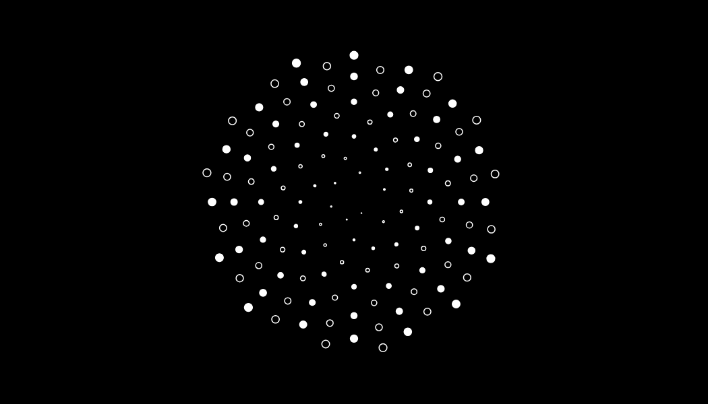

# A Framework for Generative Sketching

The goal of this tool is to provide a convenient, structured framework for making *generative art* in the browser. It is ideal for creating artworks and images with code, randomness, algorithms, and emergent systems.

The features in this framework can be used in a wide set of applications, such as mechanical pen plotting, high-quality Giclée prints, interactive web art, GIF/MP4 loops, and more.

## Installation & Setup

### With a Package Manager

If you're already familiar with [npm](https://www.npmjs.com/) (which comes with Node.js) or [yarn](https://github.com/yarnpkg/yarn), you can use either to download and install this library.

For example, using npm in your project folder:

```sh
npm install canvas-sketch
```

### Without a Package Manager

You can use this without a package manager by using the [unpkg.com](https://unpkg.com/) service and pointing to the UMD build. For example:

```html
<html>
  <body>
    <!-- Attaches canvasSketch to window global -->
    <script src="https://unpkg.com/canvas-sketch@latest/dist/canvas-sketch.umd.js"></script>
    <!-- Now you can use the library like normal -->
    <script>
      canvasSketch(() => {
        // ...
      });
    </script>
  </body>
</html>
```

You can also download the latest build [here](https://unpkg.com/canvas-sketch@latest/dist/canvas-sketch.umd.js) and include it yourself, which is easier for offline use.

## A Hello World Sketch

Each artwork is generally defined by a *sketch* function. This function prepares local state and loads any assets. This *sketch* function then returns a *renderer* function.

The *renderer* function is in charge of drawing the artwork based on `props`, i.e. the current state of the application. 

For example, take the following image:


It was generated with this script:

```js
const canvasSketch = require('canvas-sketch');

// Output parameters
const settings = {
  // The [ width, height ] size in pixels
  dimensions: [ 256, 256 ]
};

// Code for the artwork
function sketch () {
  return function renderer (props) {
    // 'props' holds the current app state
    const context = props.context;
    const width = props.width;
    const height = props.height;

    // Fill the canvas with pink
    context.fillStyle = 'pink';
    context.fillRect(0, 0, width, height);

    // Now draw a white rectangle in the center
    context.strokeStyle = 'white';
    context.lineWidth = 4;
    context.strokeRect(width / 4, height / 4, width / 2, height / 2);
  };
}

// Start the sketch with specified parameters
canvasSketch(sketch, settings);
```

### The `settings` Parameter

Also notice the `settings` object, which defines things like how the canvas should be scaled and rendered. The `dimensions` specifies the `[ width, height ]` measurements (by default, in pixels). If you don't specify settings or dimensions, the canvas will default to the full window size.

## Exporting Artworks as PNG

If you hit `Cmd + S` or `Ctrl + S` while developing (with the window in focus), the browser will download a PNG image of your canvas. Usually this file is saved to your **Downloads** folder.

We will come back to this feature later, as there are many options to export high quality prints, animation sequences, etc. You can also read more about it in the [Exporting Media](./exporting-media.md) guide.

## ES6 & Syntax Sugars

If you develop your artwork in Chrome (recommended), you can also take advantage of syntax features like arrow functions, destructuring, async/await, and more. For example, a more terse ES6 version of the above might look like this:

```js
const canvasSketch = require('canvas-sketch');

const settings = {
  dimensions: [ 256, 256 ]
};

// Start the sketch
canvasSketch(() => {
  return ({ context, width, height }) => {
    // Fill the canvas with pink
    context.fillStyle = 'pink';
    context.fillRect(0, 0, width, height);

    // Now draw a white rectangle in the center
    context.strokeStyle = 'white';
    context.lineWidth = 4;
    context.strokeRect(width / 4, height / 4, width / 2, height / 2);
  };
}, settings);
```

Note: The `props` is also passed to the *sketch* function, so you can use the context, width, height, and so forth while setting up your local state.

```js
canvasSketch(({ context, width, height }) => {
  const x = width / 2;
  const y = height / 2;

  // Render a square at the center of the page
  return () => context.fillRect(x, y, 10, 10);
});
```

## Animation Loops

You can specify `{ animation: true }` in your settings, and a requestAnimationFrame loop will be started once your sketch is loaded.

Then, in your *renderer* function, you can use the following `props` to determine how to draw your content:

- `time` - the current time of the loop in seconds
- `playhead` - the current playhead of the loop in 0..1 range
- `frame` - the current frame index of the animation
- And more, [see full list](#list)

Below is an example of a seamless loop, using `playhead` with `Math.PI` to rotate around one semicircle per loop. For endless animations (no specified duration or total frames), you can instead use the elapsed `time` in seconds to animate your scenes.


```js
const settings = {
  // Enable animation loop
  animation: true,
  // Set a finite duration for the animation
  duration: 3,
  // Set an export frame rate (default is 30)
  fps: 24,
  // Output size in pixels
  dimensions: [ 256, 256 ]
};

canvasSketch(() => {
  return ({ context, width, height, playhead, time }) => {
    // For finite loops, 'playhead' is recommended
    const rotation = playhead * Math.PI;

    // For endless animations, 'time' is better suited
    // const rotation = time;

    // ... Now draw your shapes ...
  };
}, settings);
```

> <sub>See [here](#) for the full source code of this sketch.</sub>

For details on how to export animations (like the GIF above), see the [Exporting Media](./exporting-media.md) guide.

## Physical Units

A common challenge when working with code art is figuring out how best to scale it up to a real print, for example US Letter size (8.5 x 11 inches) or even larger formats (such as 3 ft x 3 ft).

Let's say we want a generative design for a business card, which is typically 3.5 x 2 inches. We can setup our artwork like so:

```js
const settings = {
  // Measurements of artwork
  dimensions: [ 3.5, 2 ],
  // Use a higher density for print resolution
  // (this defaults to 72, which is good for web)
  pixelsPerInch: 300,
  // All our units are inches
  units: 'in'
}
```

Now, our canvas fill be scaled to fit the browser window, but the units in our *renderer* function are assumed to be in inches, including the `width` and `height` properties. This means we can, for example, specify a radius of `0.5` for a circle, and it will result in a circle with an exactly 0.5 inch radius when printed at 300 PPI.

Using the above `settings`, we can create a simple artwork with circles like so:

```js
...

const sketch = () => {
  // Utility to draw a circle
  const circle = (context, x, y, radius, fill) => {
    context.beginPath();
    context.arc(x, y, radius, 0, Math.PI * 2, false);
    if (fill) context.fill();
    context.stroke();
  };

  return ({ context, width, height }) => {
    // Here, the 'width' and 'height' are in inches
    // Fill the whole card with black
    context.fillStyle = '#000';
    context.fillRect(0, 0, width, height);

    // Now draw some circles with alternating radii
    // between 0.5 and 0.25 inches
    context.strokeStyle = '#fff';
    context.fillStyle = '#fff';
    context.lineWidth = 0.01;
    for (let i = 0; i < 5; i++) {
      const x = i / 4 * width;
      const y = height / 2;
      const radius = i % 2 === 0 ? 0.5 : 0.25;
      const fill = i % 4 === 0;
      circle(context, x, y, radius, fill);
    }
  };
};
...
```

When you save with `Cmd + S` or `Ctrl + S`, the output image will be 1050 x 600 px, which can be imported into a 3.5 x 2 in document at full resolution. You can see the exported artwork here:


<p></p>

> <sub>See [here](#) for the full source code of this sketch.</sub>

Here is another business card example, using `cos()` and `sin()` to spiral many circles around the center.



<p></p>

> <sub>See [here](#) for the full source code of this sketch.</sub>

### Large Format Printing

If you are creating a large format print, such as a huge poster, it might be slow to render in your browser as you iterate on the design. In this case, you can use the `scaleToView` option to scale the canvas to your window size, giving you crisp output and high performance. This is ignored during export, so it won't affect your output size.

```js
const settings = {
  // Scale canvas to size of browser,
  // rather than full output size.
  scaleToView: true,

  // ... other options ...
};
```

## WebGL Artworks

Often, you may want to take advantage of WebGL features to design a certain artwork. You can specify `{ context: 'webgl' }` in the settings, or specify an existing WebGL-enabled `{ context }` from a canvas. You can also specify an `attributes` object for the WebGL context creation.

If a WebGL context is used, the `props` will also provide a `gl` option for better code readability.

Below is an example with regl, which simply fills the WebGL backbuffer with pure red.

```js
const canvasSketch = require('canvas-sketch');
const createRegl = require('regl');

const settings = {
  // Use a WebGL context instead of 2D canvas
  context: 'webgl',
  // Enable MSAA in WebGL
  attributes: {
    antialias: true
  }
};

canvasSketch(({ gl }) => {
  // Setup REGL with our canvas context
  const regl = createRegl({ gl });

  // Create your GL draw commands
  // ...

  // Return the renderer function
  return () => {
    // Update regl sizes
    regl.poll();

    // Clear back buffer with red
    regl.clear({
      color: [ 1, 0, 0, 1 ]
    });

    // Draw your meshes
    // ...
  };
}, settings);
```

Here's a more interesting example in WebGL, using [glslify](https://github.com/glslify/glslify) to pull in GLSL noise and dithering modules from npm.


> <sub>See [here](#) for the full source code of this sketch.</sub>

## Asset Loading

Some artworks depend on images, sounds, fonts, and so forth. Your sketch can return a `Promise` that resolves to your *renderer* function, which allows us to load items specific to each sketch.

For convenience, we suggest the [load-asset](http://npmjs.com/package/load-asset) library and taking advantage of `async/await` support in latest browsers (like Chrome).

For example, let's say we want to load the below "Baboon" test image and glitch its pixels.


<p></p>

Our sketch might look like this:

```js
const canvasSketch = require('canvas-sketch');
const load = require('load-asset');

// We create an 'async' sketch
canvasSketch(async ({ update }) => {
  // Await the image loader, it returns the loaded 
  const image = await load('assets/baboon.jpg');

  // Once the image is loaded, we can update the output
  // settings to match it
  update({
    dimensions: [ image.width, image.height ]
  });

  // Now render our sketch
  return ({ context, width, height }) => {
    // Draw the loaded image to the canvas
    context.drawImage(image, 0, 0, width, height);

    // Extract bitmap pixel data
    const pixels = context.getImageData(0, 0, width, height);

    // Manipulate pixel data
    // ... sort & glitch pixels ...

    // Put new pixels back into canvas
    context.putImageData(pixels, 0, 0);
  };
});
```

After implementing some pixel sorting, we end up with:


<p></p>

> <sub>See [here](#) for the full source code of this sketch.</sub>

## Next Steps

If you've come this far, you can read more details here:

- [Exporting Media](./exporting-media.md)
- [API Documentation](./api.md)

<!-- 
TODO: add this to export media?
```sh
ffmpeg -r 24 -i tmp/%03d.png -y -vf fps=10,scale=256:-1:flags=lanczos,palettegen output_palette.png && ffmpeg -i tmp/%03d.png -i output_palette.png -y -filter_complex "fps=24,scale=256:-1:flags=lanczos[x];[x][1:v]paletteuse" output.gif
```
-->