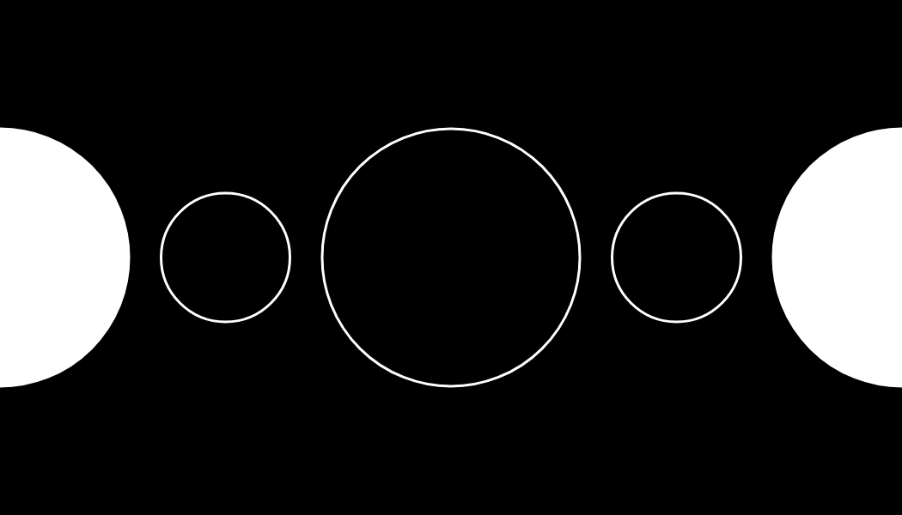
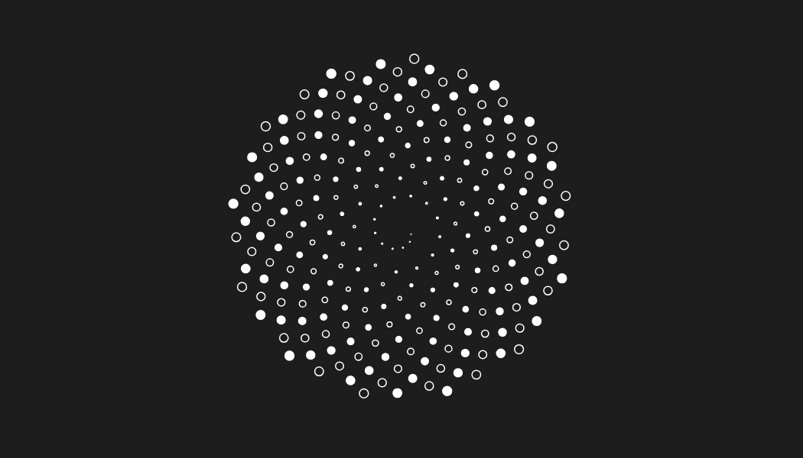
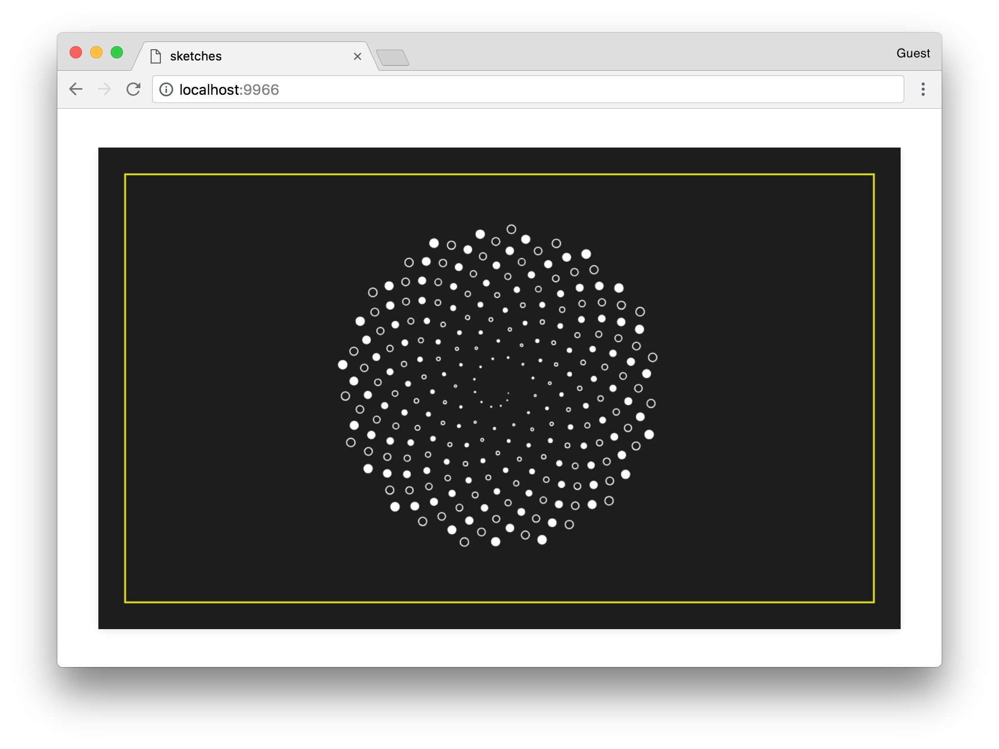

#### <sup>:closed_book: [canvas-sketch](../README.md) → [Documentation](./README.md) → Developing with Physical Units</sup>

---

### Developing with Physical Units

A common challenge when working with code art is figuring out how best to scale it up to a real print, for example US Letter size (8.5 x 11 inches) or even larger formats (such as 3 ft x 3 ft).

Let's say we want a generative design for a business card, which is typically 3.5 x 2 inches. We can setup our artwork like so:

```js
const settings = {
  // Measurements of artwork
  dimensions: [ 3.5, 2 ],
  // Use a higher density for print resolution
  // (this defaults to 72, which is good for web)
  pixelsPerInch: 300,
  // All our units are inches
  units: 'in'
}
```

Now, our canvas fill be scaled to fit the browser window, but the units in our *renderer* function are assumed to be in inches, including the `width` and `height` properties. This means we can, for example, specify a radius of `0.5` for a circle, and it will result in a circle with an exactly 0.5 inch radius when exported and printed at 300 PPI.

Using the above `settings`, we can create a simple artwork with circles like so:

```js
...

const sketch = () => {
  // Utility to draw a circle
  const circle = (context, x, y, radius, fill) => {
    context.beginPath();
    context.arc(x, y, radius, 0, Math.PI * 2, false);
    if (fill) context.fill();
    context.stroke();
  };

  return ({ context, width, height }) => {
    // Here, the 'width' and 'height' are in inches
    // Fill the whole card with black
    context.fillStyle = '#000';
    context.fillRect(0, 0, width, height);

    // Now draw some circles with alternating radii
    // between 0.5 and 0.25 inches
    context.strokeStyle = '#fff';
    context.fillStyle = '#fff';
    context.lineWidth = 0.01;
    for (let i = 0; i < 5; i++) {
      const x = i / 4 * width;
      const y = height / 2;
      const radius = i % 2 === 0 ? 0.5 : 0.25;
      const fill = i % 4 === 0;
      circle(context, x, y, radius, fill);
    }
  };
};
...
```

When you save with `Cmd + S` or `Ctrl + S`, the output image will be 1050 x 600 px, which can be imported into a 3.5 x 2 inch document at 300 PPI resolution. You can see the exported artwork here:



<p></p>

Here is another business card example, using `cos()` and `sin()` to spiral many circles around the center.



<p></p>

> <sub>See [here](../examples/canvas-dot-flower.js) for the full source code of this sketch.</sub>

### Paper Size Presets

For convenience, `canvas-sketch` includes presets for a variety of common paper sizes such as `"A4"`, `"letter"`, `"arch-2"` etc. You can specify these as case-insensitive strings to the `dimension` object, like so:

```js
const settings = {
  // For print output
  pixelsPerInch: 300,
  // Results in 21 x 29.7 cm
  dimensions: 'A4',
  // You can still work in your preferred units
  units: 'in'
};
```

All these preset dimensions are in portrait by default, but you can use the `{ orientation }` setting to flip to landscape (i.e. more wide than tall). This setting also works with regular `[ x, y ]` dimensions, forcing the dimensions to produce one or the other paper orientation.

```js
const settings = {
  dimensions: 'postcard',
  orientation: 'landscape' // also supports 'portrait'
};
```

For a full list of supported paper sizes, see the [lib/paper-sizes.js](../lib/paper-sizes.js) definitions.

### Bleeds & Safe Zones

In the earlier business card print, we saved the file at exactly 3.5 x 2 inches, but the file sent to the printer should really include a "safe zone" called a *bleed* to ensure the background trims nicely around the edges.

A simple way to do this is to add a `{ bleed }` setting, which increases the width and height dimensions by `2.0 * bleed`.

You can use `trimWidth` and `trimHeight` props to get back the original "trim size" of your paper, i.e. what you expect it to be once cut down by the printer.

In the final [canvas-dot-flower.js](../examples/canvas-dot-flower.js) example, we draw a "safe zone" to visualize what the business card looks like within our trim area.


<p align="center">
  
</p>

Using the `exporting` prop, we can ignore rendering this yellow outline on PNG output.

```js
const settings = {
  // Output resolution, we can use 300PPI for print
  pixelsPerInch: 300,
  // All our dimensions and rendering units will use inches
  units: 'in',
  // Standard business card size
  dimensions: [ 3.5, 2 ],
  // Include a bit of 'bleed' to the dimensions above
  bleed: 1 / 8
};

canvasSketch(() => {
  // Render the business card
  return props => {
    const {
      context, exporting, bleed,
      width, height,
      trimWidth, trimHeight
    } = props;

    // Fill entire page with solid color
    context.fillStyle = '#1d1d1d';
    context.fillRect(0, 0, width, height);

    // Visualize the trim area with a yellow guide (ignored on export)
    if (!exporting && bleed > 0) {
      context.strokeStyle = 'yellow';
      context.lineWidth = 0.0075;
      context.strokeRect(bleed, bleed, trimWidth, trimHeight);
    }

    // ... rest of sketch
```

Also in this sketch, we use the `trimHeight` so the maximum radius just reaches the edge of the card, and then pull it back by 1/4" to create some padding from the yellow line.

```js
const maxRadius = (trimHeight / 2) - (1 / 4);
```

### Running `canvas-sketch` in Node.js for Very Large Prints

You can also use Node.js to export high-resolution print artwork, see the [Exporting Artwork](./exporting-artwork.md#node-export) guide for details.

## 

<sub>Now that you're exporting high-resolution prints, you should read about [Exporting Artwork to PNG, GIF, MP4 and Other Files](./exporting-artwork.md).</sub>

#### <sup>[← Back to Documentation](./README.md)
