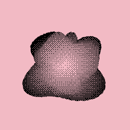

#### <sup>:closed_book: [canvas-sketch](../README.md) → [Documentation](./README.md) → WebGL, GLSL, Three.JS and More</sup>

---

### WebGL, GLSL, Three.JS and More

Often, you may want to take advantage of WebGL features to design a certain artwork. You can specify `{ context: 'webgl' }` in the settings, or specify an existing WebGL-enabled `{ context }` from a canvas.

When your sketch is WebGL-enabled, the `props` will also provide a `gl` option for better code readability.

Below is an example with [regl](https://github.com/regl-project/regl) (a thin WebGL wrapper), which simply fills the WebGL backbuffer with pure red.

```js
const canvasSketch = require('canvas-sketch');
const createRegl = require('regl');

const settings = {
  // Use a WebGL context instead of 2D canvas
  context: 'webgl',
  // Enable MSAA in WebGL
  attributes: {
    antialias: true
  }
};

canvasSketch(({ gl }) => {
  // Setup REGL with our canvas context
  const regl = createRegl({ gl });

  // Create your GL draw commands
  // ...

  // Return the renderer function
  return () => {
    // Update regl sizes
    regl.poll();

    // Clear back buffer with red
    regl.clear({
      color: [ 1, 0, 0, 1 ]
    });

    // Draw your meshes
    // ...
  };
}, settings);
```

### GLSL Files

The `canvas-sketch-cli` tool comes built-in with [glslify](https://github.com/glslify/glslify) support, which will inline GLSL files as strings in your JavaScript bundle.

Save your GLSL file with `.frag`, `.vert`, or `.glsl` extension, and you can require it like so:

```js
const shader = require('./cool-shader.frag');

// the processed GLSL source string
console.log(shader);
```

Alternatively, you can use `glslify` syntax directly. The above is equivalent to:

```js
const path = require('path');
const glslify = require('glslify');

// this will get inlined into a string at bundle time
const frag = glslify(path.resolve(__dirname, 'cool-shader.frag'));
```

You can also use template strings if you wish to keep your GLSL code contained within your sketch files.

### Using glslify for modular GLSL

Because the GLSL files are processed, you can import shaders from npm, like [glsl-noise](https://github.com/hughsk/glsl-noise). Use the following command to add it to your `package.json` file:

```sh
npm install glsl-noise
```

Now, you can import it into your GLSL. For example:

```js
const glslify = require('glslify');

const vertex = glslify(`
  #pragma glslify: noise = require('glsl-noise/simplex/3d');

  void main () {
    ...
  }
`)
```

> :bulb:
>
> <sub>If you are using VSCode, you can achieve GLSL syntax highlighting with [Comment Tagged Templates](https://marketplace.visualstudio.com/items?itemName=bierner.comment-tagged-templates) and [GLSL Syntax](https://marketplace.visualstudio.com/items?itemName=slevesque.shader) extensions.</sub>

This technique was used in the following animated WebGL sketch:



> <sub>See [here](../examples/animated-regl-dither-blob.js) for the full source code of this sketch.</sub>

### Live Shader Coding

You can use [Hot Reloading](./hot-reloading.md) to make a live coding environment for GLSL shaders. For convenience, you can use the [canvas-sketch-util/shader](https://github.com/mattdesl/canvas-sketch-util/blob/master/docs/shader.md) module.

The CLI includes a `shader` template when creating new sketches:

```sh
canvas-sketch test.js --new --template=shader --hot --open
```

This will scaffold & start a basic shader rendered by [regl](http://regl.party/):

```js
const canvasSketch = require('canvas-sketch');
const createShader = require('canvas-sketch-util/shader');
const glsl = require('glslify');

// Setup our sketch
const settings = {
  context: 'webgl',
  animate: true
};

// Your glsl code
const frag = glsl(`
  precision highp float;

  uniform float time;
  varying vec2 vUv;

  void main () {
    vec3 color = 0.5 + 0.5 * cos(time + vUv.xyx + vec3(0.0, 2.0, 4.0));
    gl_FragColor = vec4(color, 1.0);
  }
`);

// Your sketch, which simply returns the shader
const sketch = ({ gl }) => {
  // Create the shader and return it
  return createShader({
    // Pass along WebGL context
    gl,
    // Specify fragment and/or vertex shader strings
    frag,
    // Specify additional uniforms to pass down to the shaders
    uniforms: {
      // Expose props from canvas-sketch
      time: ({ time }) => time
    }
  });
};

canvasSketch(sketch, settings);
```

You can now edit & save the script to see the shader hot-reload.

<a name="threejs"></a>

### Using Three.js, P5.js, and Other Libraries

As you can see from the previous `regl` example, it is fairly straight-forward to use other libraries alongside `canvas-sketch`. In fact, `canvas-sketch` was intentionally designed to make *zero* assumptions about the rendering library being used.

Here are some examples:

- [ThreeJS – Basic Cube](../examples/animated-three-basic-cube.js)
- [p5.js – Basic Example](../examples/animated-p5.js)

## 

<sub>Now that you've covered most of the guide, check out [Other Topics](./other-topics.md) for a few more tricks, like rendering to an AxiDraw Mechcanical Pen Plotter.</sub>

#### <sup>[← Back to Documentation](./README.md)